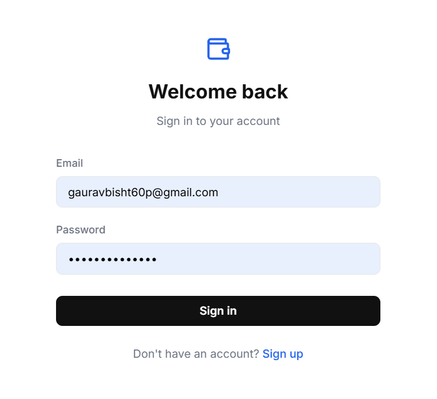
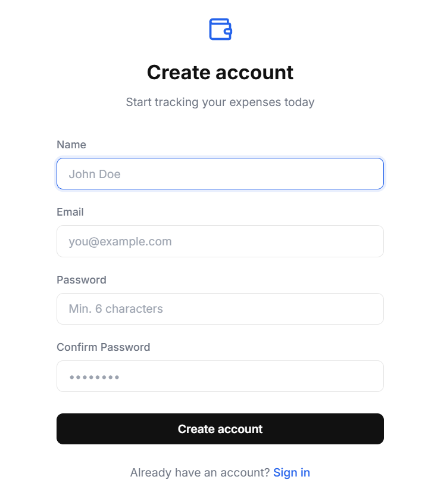
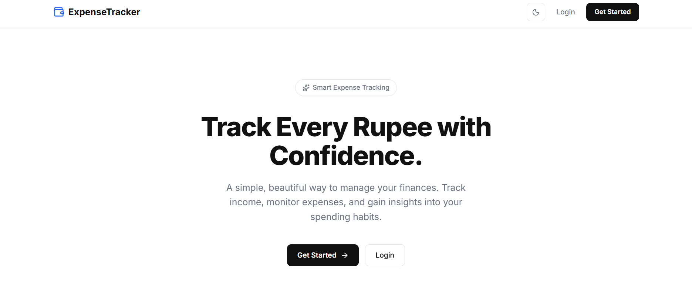
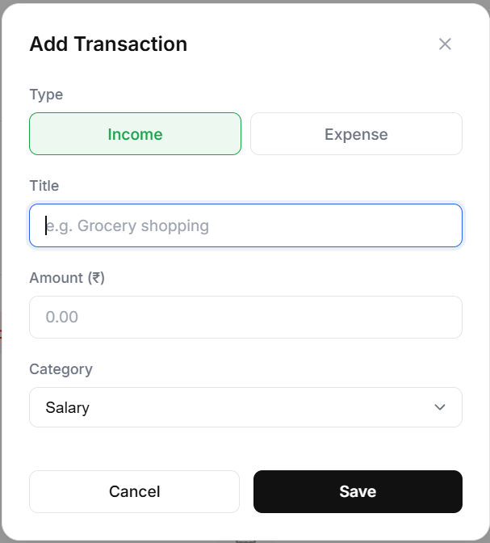
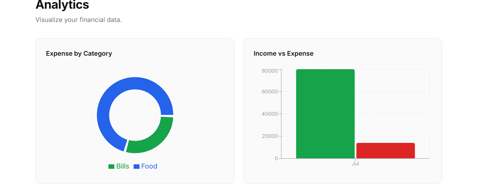
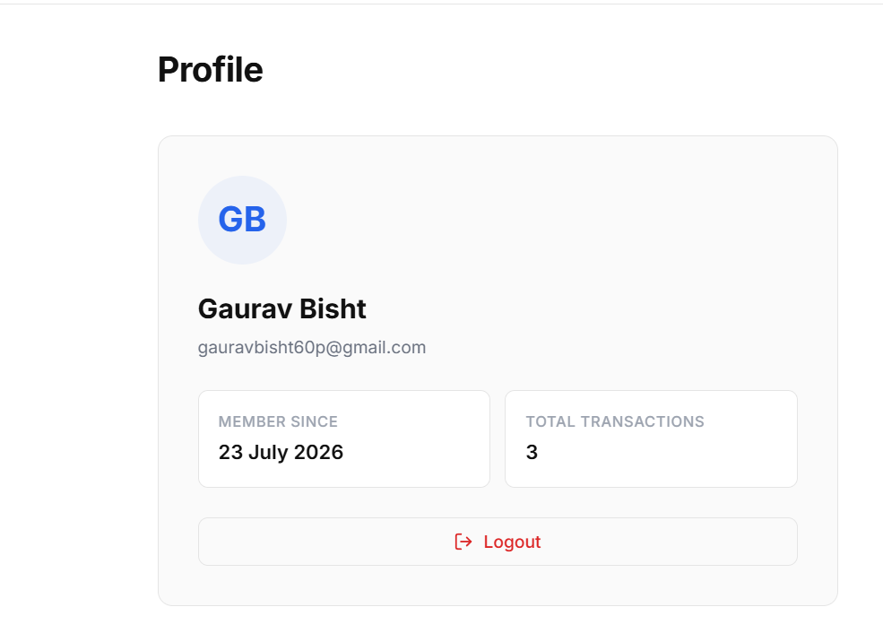

# Expense Tracker (MERN Stack)

This is a simple Expense Tracker web application developed using the MERN Stack. It helps users keep track of their income and expenses in one place.

---

## Project Title

Expense Tracker using MERN Stack

---

## Problem Statement

Many people find it difficult to manage their daily income and expenses manually. This project provides a simple way to record transactions and view them whenever required.

---

## Features

- User Registration
- User Login
- Secure Authentication using JWT
- Add Income
- Add Expense
- Delete Transactions
- View Transaction History
- Analytics Dashboard

---

## Technologies Used

### Frontend
- React.js
- CSS
- Axios

### Backend
- Node.js
- Express.js

### Database
- MongoDB

### Authentication
- JWT

### Version Control
- Git
- GitHub

---

## Screenshots

### Login



### Register



### Dashboard



### Add Transaction



### Analytics



### Transaction History



---

## Installation Steps

### Clone the repository

```bash
git clone https://github.com/gauravbisht70p-tech/expense-tracker-mern.git
cd expense-tracker-mern
```

### Install Backend

```bash
npm install
npm start
```

### Install Frontend

```bash
cd client
npm install
npm run dev
```

---

## Future Scope

- Monthly reports
- Charts and graphs
- Budget planning
- Export reports as PDF
- Mobile application

---

## Author Information

**Name:** Gaurav

**Course:** BCA

**Project:** Expense Tracker (MERN Stack)

**GitHub:** https://github.com/gauravbisht70p-tech

**LinkedIn:** https://www.linkedin.com/in/gaurav-bisht-8aba06338